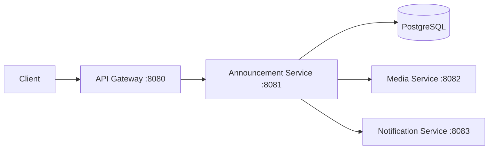

# PulseOps

Production-style Kubernetes observability demo: four microservices that implement a minimal **announcement** flow (create → optional media → notify), with **Prometheus** metrics on every service.

This repo is being built incrementally against the full PRD (Kubernetes, Terraform, Grafana, OpenTelemetry, k6, CI/CD). **What exists today** is *Week 2 / Kubernetes foundation*: Node.js (Fastify) services, Dockerfiles, Docker Compose, and k3d-ready Kubernetes manifests.

## Architecture (current)



Traffic: `POST /announcements` hits the gateway, which forwards to the announcement service. That service persists to Postgres, optionally calls media processing, then triggers notification simulation.

## Run locally (Docker Compose)

```bash
docker compose up --build
```

Smoking the gateway (from repo root):

```bash
chmod +x scripts/run-smoke-test.sh
./scripts/run-smoke-test.sh
```

Manual one-liner:

```bash
curl -s http://localhost:8080/announcements -X POST \
  -H 'content-type: application/json' \
  -d '{"title":"Hello","body":"World","targetGroup":"eng"}'
```

## Endpoints (per service)

| Service | Health | Ready | Metrics | Core API |
|--------|--------|-------|---------|----------|
| API Gateway | `GET /healthz` | `GET /ready` | `GET /metrics` | `POST /announcements` |
| Announcement | `GET /healthz` | `GET /ready` (DB check) | `GET /metrics` | `POST /internal/announcements`, `GET /announcements/:id` |
| Media | `GET /healthz` | `GET /ready` | `GET /metrics` | `POST /internal/media/process` |
| Notification | `GET /healthz` | `GET /ready` | `GET /metrics` | `POST /internal/notify` |

Failure simulation (media): header `X-Simulate-Media-Failure: true` or query `?fail=1` on media process (used when called from announcement with propagated headers — extend as needed).

## Develop without Docker

Each service is a standalone npm package:

```bash
cd services/api-gateway && npm install && npm run build && npm start
```

Set `ANNOUNCEMENT_SERVICE_URL`, `DATABASE_URL`, `MEDIA_SERVICE_URL`, and `NOTIFICATION_SERVICE_URL` as in `docker-compose.yml`.

## Run locally (Kubernetes with k3d)

Install prerequisites:

```bash
brew install k3d kubectl
```

Create the local cluster:

```bash
./scripts/create-k3d-cluster.sh
```

Deploy the stack:

```bash
./scripts/deploy-local-k8s.sh
```

Smoke test the Kubernetes gateway:

```bash
./scripts/k8s-smoke-test.sh
```

The local overlay exposes the API Gateway through k3d on `http://localhost:8088`.

Useful Kubernetes commands:

```bash
kubectl -n pulseops get pods,svc,hpa
kubectl -n pulseops logs deployment/api-gateway
kubectl -n pulseops rollout status deployment/api-gateway
```

## Kubernetes Concepts Used

- `Deployment`: keeps the desired number of pods running and replaces failed pods.
- `Service`: gives each workload a stable DNS name, such as `http://media-service:8080`.
- `readinessProbe`: controls whether a pod receives traffic.
- `livenessProbe`: lets Kubernetes restart a stuck container.
- `resources.requests/limits`: reserves CPU/memory and caps runaway usage.
- `HorizontalPodAutoscaler`: scales the API Gateway between 2 and 5 replicas based on CPU.
- `Kustomize`: separates reusable base manifests from local-only patches.

## Roadmap (PRD milestones)

1. **Week 1** — Services + Compose *(done)*  
2. **Week 2** — k3d, Kubernetes manifests, Postgres in-cluster *(done)*  
3. **Week 3** — Prometheus/Grafana, dashboards  
4. **Week 4** — OpenTelemetry collector + Tempo/Jaeger, GitHub Actions  
5. **Week 5** — k6, HPA, failure drills, README screenshots  

---

### Resume bullet (target when complete)

Built a production-style Kubernetes platform for four microservices with Terraform, GitHub Actions, Prometheus, Grafana, and OpenTelemetry, enabling automated deployments, p95 latency tracking, distributed tracing, and sub-30s pod recovery under simulated load.
